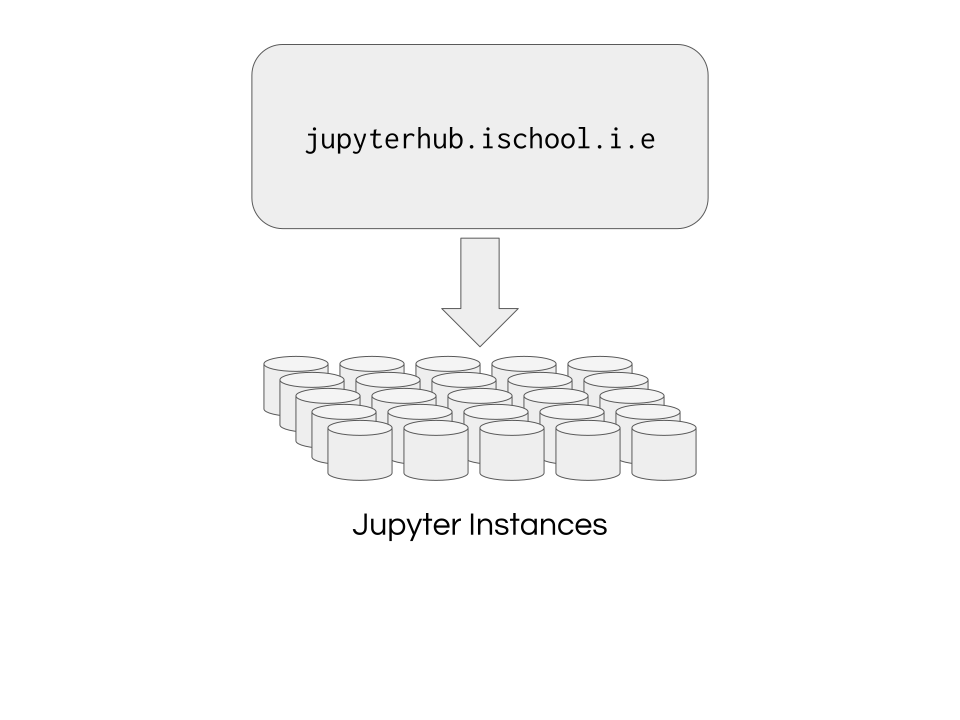

<!-- .slide: class="titleslide" -->

# Intro to Scientific Computing & Data Viz

## Jill P. Naiman
## Summer 2019

---
<!-- .slide: class="vertical_center" -->
## Basics

12-3PM M/T/W/Th/F

Jill Naiman - `jnaiman@illinois.edu`

 * Office Hours: TBD

TA: TBD

https://jnaiman.github.io/csci-p-14110/

notes: go through website!!

---

## Questions:

* Who are you?
* What are we doing?
* How are we going to do it?

---

## Questions:

* Who are you?
* What are we doing?
* How are we going to do it?

---

### My background

<!---->

---

### My background

---

### My background

---

### My background

---

### My background
#### ytini.com

Naiman et al. 2017, Borkiewicz et al. 2018

---

### My background
#### ytini.com

Naiman et al. 2017, Borkiewicz et al. 2018

---

### My background
#### ytini.com

Naiman et al. 2017, Borkiewicz et al. 2018

---

### My background
#### ytini.com

Naiman et al. 2017, Borkiewicz et al. 2018

---

## Canvas Webpage

---

## Timed activity! (~2 minutes)

notes: a quick intro activity

---

## Quick chat with your neighbor

notes: discusison of timed activity

---

## Download Anaconda!

[anaconda.com/download](anaconda.com/download)

---

## Syllabus

notes: go over syllabus

---

# Class Mission

notes: class mission

---

# The Things I Want You To Take Away

---

## Overview - Themes and Goals

1. What are the components of an effective visualization of quantitative data?
1. What tools and ecosystems are available for visualizing data?
1. What systems can be put in place to generate visualizations rapidly and with high-fidelity representation?

---

## Structure of Class

 * Topic introduction and lecture (~60 minutes)
 * Hands-on, collaborative coding
 * Wrap-up

(Today will be a little lecture heavy)

notes:
This structure will likely be deviated from during the course, but in general
we will start with lecture, take a break, then continue with collaborative or
hands-on exercises using group coding.

During the group coding, I might lead the class in some visualization in
Python, Javascript, or something else.  During this section, I expect that
students will *follow along* with what is going on -- typing in the specific
commands, and maybe even trying different things as we go.  It is not meant to
simply be a "performance" of coding, but instead an opportunity to learn.

---

## Assignments

 * Daily, assigned in class, collected following class
 * Prose assignments: 
 * Coding assignments: 
 * Physics assignments:

---

## Plagiarism

 * Plagiarism is about copying ideas.
 * Cite all code you utilize from elsewhere.

notes:
When programming, I expect that you will do things like search on the internet
to find help with a given problem.  This is fine.

But, you *must* cite where any code snippets came from.  And you *must* note if
you are working with other people in the group!

Using snippets of code is fine -- but you may not copy large-scale amounts of
code from other work (for example, other visualizations) and pass it off as
your own.  Always cite, and be reasonable in what you utilize.

---

## Our tools

 * Python
 * Jupyter and Jupyter notebooks (maybe on a Jupyterhub)
 * The occasional usage of a shell such as bash
 * Slack

notes:
You will be expected to write code in Python, and to learn the very basics of
Javascript.  Your projects may be turned in via git.  We will also utilize
Slack for class communication.

---

## Jupyterhub when it is working...

notes:
Jupyterhub is a software system for launching multiple independent notebooks
that can share access to data and installed software.  Ours is administered by
the iSchool.

---

## Jupyterhub Guidelines

 * [jupyterhub.ischool.illinois.edu](https://jupyterhub.ischool.illinois.edu/)
 * Please store your notebooks on- and off-site
<!-- * Submissions will be via `nbgrader`-->
<!-- * Data will be available at `/home/shared/spr18-is590dv/data/`-->
<!-- * Previous lectures will be in `/home/shared/spr18-is590dv/fall2018/`-->
 * You will have access to conda, etc, but I may rebuild images to add packages.
 * There will be shared data directories, but again, this depends on jupyterhub
 being online.

notes:
It is possible that your JupyterHub instance may be lost -- don't store mission
critical data there without a backup.  It should be possible to share data
between people on the system, but I won't pretend to know the right way to do
that.

---

## Slack

We will be sharing a slack channel with the in-person class, so feel free to
converse with them as well!

 * Team channel at `https://is590dv-spring2019.slack.com`
   * `#general` : General announcements
   * `#assignments` : Help with assignments
   * `#help` : General help with Python, Javascript, visualization, etc
   * `#_classroom-lectures` : Folks in the live lecture will post questions here during class
   * `#online_specific_chat` : Can be used to ask online specific questions, but all "in class"
   questions should be posted in the Blackboard Collaborate chat, or asked over a mic

---

## Slack (cont)

 * Use the `@` sign appropriately: `@[person]`, `@here`, `@channel`
 * Web client, standalone client and mobile devices can access this team.
 * At the end of the semester, the team will be discontinued.
 * Please think carefully before direct messaging if you could ask in a public
   forum instead.
 * Conduct will be held to same standards as any educational venue.

As always, you can also post questions to the Moodle forum as well.

notes:
Please use slack as much as you need!  You can use it to share items and
articles with the class, to collaborate, to discuss and ask questions and get
feedback.  However, please do behave in a professional fashion.

---

## Github

 * Course repo is at [UIUC-iSchool-DataViz/spring2019online](https://github.com/UIUC-iSchool-DataViz/spring2019online/)
 * Automatically built to [uiuc-ischool-dataviz.github.io/spring2019online/](https://uiuc-ischool-dataviz.github.io/spring2019online/)
 * When/if JupyterHub is up and running: Lecture notes will be placed there, and available in your JupyterHub
   instances in `shared/sp19-is590dv/spring2019online`
 * Copy the notebooks to your directory before using them.
 * Supplemental materials can be found at [UIUC-iSchool-DataViz/support-files](https://github.com/UIUC-iSchool-DataViz/support-files)

notes:
All the materials for this course will be stored in github, and are available
under a very permissive license.  It is largely written in markdown and
automatically compiled to web pages when changes are made.

You are invited to clone the repo, fork and submit changes (typos, etc!), and
to use any information in it in the future.

---

## Assignment 1

 * Words

