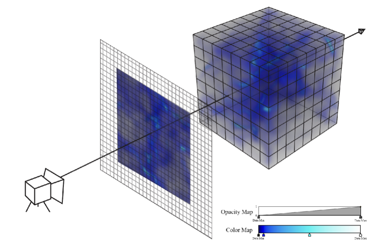
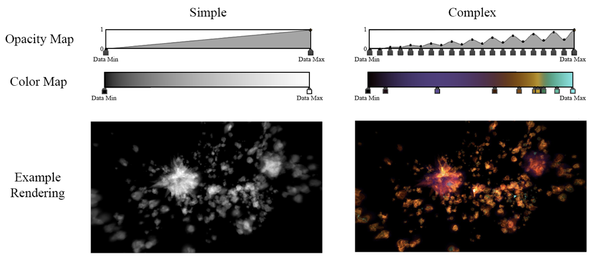

<!-- .slide: class="titleslide" -->

# Intro to Scientific Computing & Data Viz

## Jill P. Naiman
## Summer 2019

---
<!-- .slide: class="vertical_center" -->
## Basics

12-3PM M/T/W/Th/F

Jill Naiman - `jnaiman@illinois.edu`

 * Office Hours: TBD

TA: TBD

Class webpage: https://jnaiman.github.io/csci-p-14110/ (more on this a little later)

notes: we'll go over the class webpage a little more in a few slides

---

## Questions:

* Who are you?
* What are we doing?
* How are we going to do it?

---

## Questions:

* Who are you?
* What are we doing?
* How are we going to do it?

---

### My background

<!---->

notes: so my PhD is in theoretical and computational astrophysics

here is a picture of a simulation I worked on

---

### My background

notes: here I've highlighted a few things - the purple is this stuff called "dark matter" which makes up about 95% of our universe

the orange stuff are concentrations of gas where galaxies form

Don't know what galaxies are?  Don't worry!  We'll go over it later in class

---

### My background

notes: if you looked deep within these centers of gas you'd find galaxies forming

Here are some pictures of "fake" galaxies that this simulation produced

BE AWARE: the basic numerical technqiues used in this large simulation, including how these images are made, are thing we will cover in this very class!

---

### My background
#### ytini.com

Naiman et al. 2017, Borkiewicz et al. 2018

notes: I've also worked for the past several years with folks at the Advanced Visualization Laboratory at the National Center for Supercomputing Applications at the University of Illinois

These are computer scientists and visual effects artists that make a lot of scientific documentaries and IMAX shows

Here is an example of how the process of taking a simulation box and making an image works

---

### My background
#### ytini.com

Naiman et al. 2017, Borkiewicz et al. 2018

notes: in this class we will discuss how to make images of our simulation and what goes into this process - how can we use colors to highlight different aspects of our simulation?  These sorts of questions we'll answer in the 2nd week of class

---

### My background
#### ytini.com

Naiman et al. 2017, Borkiewicz et al. 2018

notes: here are just some gratiuitus pretty images that the advanced visualization lab made

---

### My background
#### ytini.com

Naiman et al. 2017, Borkiewicz et al. 2018

---

## Timed activity! (~2 minutes)

Turn to your neighbor and:
1. Introduce yourself - what is your name and where are you from?
1. What is your favorite science topic?

notes: I realize this is a little hokey, but we do really need to get to know eachother!

---

## Timed activity! (~2 minutes)

Turn to your *other* neighbor and:
1. Introduce yourself - what is your name and where are you from?
1. What are you excited to learn about in this class?

notes: I realize this is a little hokey, but we do really need to get to know eachother!

---

## Questions:

* Who are you?
* What are we doing?
* How are we going to do it?

---

## Questions:

* ~~Who are you?~~
* What are we doing?
* How are we going to do it?

---

## What are we doing?

Essentially:

<iframe width="560" height="315" src="https://www.youtube.com/embed/o2lRpiediP8?start=340" frameborder="0" allow="accelerometer; autoplay; encrypted-media; gyroscope; picture-in-picture" allowfullscreen></iframe>

The data for this movie snippet was simulated using similar numerical methods to what are going to build in this class.

The movie was created in AVL using visualization methods we will make use of in week 2 (our's won't be as polished, but this viz was built by a team of experts!).

notes: essentially, we'll be doing this, more or less

The data for this movie is generated from something called an SPH simulation - SPH stands for smooth particle hydordynamics.  This solves *both* gravitational *and* hydrodynamical (i.e. how gas interacts) forces - we'll just be solving for gravitational forces in this class, specifically this first week.

The data outputs from this simulation are scientific in nature - so things like particle temperature, velocity, location, but translating that into colors and shapes is the job of the visualization expert - we'll start thinking about methods to do just that in the 2nd week of this class.

---

## What are we doing?

<iframe width="400" height="300" src="https://sketchfab.com/models/ece18031ea59414f8b4a506a7d45a62e/embed" frameborder="0" allow="autoplay; fullscreen; vr" mozallowfullscreen="true" webkitallowfullscreen="true"></iframe>

    <a href="https://sketchfab.com/3d-models/my-solar-system-ece18031ea59414f8b4a506a7d45a62e?utm_medium=embed&utm_source=website&utm_campaign=share-popup" target="_blank" style="font-weight: bold; color: #1CAAD9;">My Solar System</a>
    by <a href="https://sketchfab.com/jnaiman?utm_medium=embed&utm_source=website&utm_campaign=share-popup" target="_blank" style="font-weight: bold; color: #1CAAD9;">jnaiman</a>
    on <a href="https://sketchfab.com?utm_medium=embed&utm_source=website&utm_campaign=share-popup" target="_blank" style="font-weight: bold; color: #1CAAD9;">Sketchfab</a>

<iframe width="400" height="300" src="https://sketchfab.com/models/d9edf3cc17d94039b4272dd2563e41e9/embed" frameborder="0" allow="autoplay; fullscreen; vr" mozallowfullscreen="true" webkitallowfullscreen="true"></iframe>

    <a href="https://sketchfab.com/3d-models/galaxy-merger-model-d9edf3cc17d94039b4272dd2563e41e9?utm_medium=embed&utm_source=website&utm_campaign=share-popup" target="_blank" style="font-weight: bold; color: #1CAAD9;">Galaxy Merger Model</a>
    by <a href="https://sketchfab.com/jnaiman?utm_medium=embed&utm_source=website&utm_campaign=share-popup" target="_blank" style="font-weight: bold; color: #1CAAD9;">jnaiman</a>
    on <a href="https://sketchfab.com?utm_medium=embed&utm_source=website&utm_campaign=share-popup" target="_blank" style="font-weight: bold; color: #1CAAD9;">Sketchfab</a>

  

We'll start off simply but there are ways to extend the complexity of our [planetary models](https://sketchfab.com/3d-models/solar-sistem-00c2fd1b0cf74846b540c3c4b95e7f6b).

notes: we'll build to things like this with planetary systems and/or galactic systems that you calculate the motions and shapes for this week

Here I'm just showing similar examples with a (hopefully) familiar planetary system and a galaxy simulation I worked with a little while ago

---

## What are we doing?

To do this, we need to know the following things:

---

## What are we doing?

To do this, we need to know the following things:
1. Astronomy: 
 * we'll learn a bit about planets, stars, and galaxies
 
notes: From the survey most folks don't have an astronomy background so we'll spend a bit of time learning about that

---

## What are we doing?

To do this, we need to know the following things:
1. Astronomy: 
 * we'll learn a bit about planets, stars, and galaxies
1. Physics: 
 * circular motion, gravity, and how objects move in orbits under the influence of gravity
 * we'll look at the analytical solution for 2-gravitating-body motion
 
notes:

Folks have a variety of physics, math - this is great!
 * we'll go over some aspects of circular motion in general, and 2-body orbits - this will be review for most, but there will be plenty of time to get caught up on homework and you can always ask questions!
 * I'll provide a writeup of the full, calculus-based solutions for kepler's laws of motions - since calculus is not a requirement for this class, we'll just cover some ways to apply kepler's laws to problems. 
   * feel free to re-check up on the calculus solution once you've taken some calculus classes!

---

## What are we doing?

To do this, we need to know the following things:
1. Astronomy: 
 * we'll learn a bit about planets, stars, and galaxies
1. Physics: 
 * circular motion, gravity, and how objects move in orbits under the influence of gravity
 * we'll look at the analytical solution for 2-gravitating-body motion
1. Programming: 
 * the basics - what is programming?  Flow control, functions, calculations and beyond!
 * how to use code to solve for the motion of more than 2 objects in a gravitational system
 * how to use code to translate our scientific simulations into neat visualizations (images, movies, and on the web)
 
notes:

Folks have a variety of coding backgrounds as well - this is also great!
 * we'll go over some basics of coding practices today and tomorrow as well - again, this will be review for some and totally new for others and that is totally fine!

---

## Questions:

* Who are you?
* What are we doing?
* How are we going to do it?

---

## Questions:

* ~~Who are you?~~
* ~~What are we doing?~~
* How are we going to do it?

notes: ok, we've gone over the who and the what, now lets get to the "how" - what resources are we going to make use of for this project?

---

## Resources:

1. Class webpage: https://jnaiman.github.io/csci-p-14110/ 
   * lecture slides
   * coding "notebooks"
   * external resources

notes: go through website!!

highlights:
* references like python & matplotlib
* cheat sheets ofr markdown and jupyter
* slack channel
* lessons -> go to lesson 1
  * lesson plans will give overviews of what we are doing that day at the top, then any resources (installation notes today), and then materials like lecture slides & notebooks will be linked at the bottom

---

## Resources:

1. Class webpage: https://jnaiman.github.io/csci-p-14110/ 
   * lecture slides
   * coding "notebooks"
   * external resources
1. Canvas Page: https://canvas.harvard.edu/courses/57025
   * This is where quizzes and homeworks will be assigned and turned in.

notes: Homework & quizzes will be turned in on the canvas webpage

---

## Resources:

1. Class webpage: https://jnaiman.github.io/csci-p-14110/ 
   * lecture slides
   * coding "notebooks"
   * external resources
1. Canvas Page: https://canvas.harvard.edu/courses/57025
   * This is where quizzes and homeworks will be assigned and turned in.
1. Anaconda: [https://www.anaconda.com/distribution/#download-section](https://www.anaconda.com/distribution/#download-section)
   * For now - just download this file, we'll talk about how to use it later in class
   * __Make sure you download Python version 3 not 2!!__
   
**SLACK CHANNEL???**

notes: We will be using the Anaconda package manager to install the programming language Python as well as any additional libraries we might need, as well as to launch jupyter notebooks with

If all those words seem confusing to you, don't worry!  We'll go over them more later in class

Right now - please go to the webpage listed and download Anaconda for Python 3 (should say 3.7 or something like this)

We'll go over how to install later in class, but lets all get it downloaded first since it may take a while
  
---

** we will model planetary systems and galaxies **

* but first: some book keeping:  slack, basic usage, syllabus, class basics; outline of class - lecture in beginning, coding in 1/2 half (more coding, less lectures as week goes on and you are working on projects)

* class vibe: kind, constructive, inquiry based, non-competitive - no lone wolfs - these don't exist in science

* will start with programming on our own, then will form groups to work on code together

* then: lets learn about astronomy - the basics of how we got here, what are planets, stars, galaxies
* then: lets learn about orbital motion, kepler's laws and conservation of energy and momentum
* then: lets learn about the basics of programming

---

## Syllabus

notes: go over syllabus

---

# Class Mission

notes: class mission

---

# The Things I Want You To Take Away

---

## Overview - Themes and Goals

1. What are the components of an effective visualization of quantitative data?
1. What tools and ecosystems are available for visualizing data?
1. What systems can be put in place to generate visualizations rapidly and with high-fidelity representation?

---

## Structure of Class

 * Topic introduction and lecture (~60 minutes)
 * Hands-on, collaborative coding
 * Wrap-up

(Today will be a little lecture heavy)

notes:
This structure will likely be deviated from during the course, but in general
we will start with lecture, take a break, then continue with collaborative or
hands-on exercises using group coding.

During the group coding, I might lead the class in some visualization in
Python, Javascript, or something else.  During this section, I expect that
students will *follow along* with what is going on -- typing in the specific
commands, and maybe even trying different things as we go.  It is not meant to
simply be a "performance" of coding, but instead an opportunity to learn.

---

## Assignments

 * Daily, assigned in class, collected following class
 * Prose assignments: 
 * Coding assignments: 
 * Physics assignments:

---

## Plagiarism

 * Plagiarism is about copying ideas.
 * Cite all code you utilize from elsewhere.

notes:
When programming, I expect that you will do things like search on the internet
to find help with a given problem.  This is fine.

But, you *must* cite where any code snippets came from.  And you *must* note if
you are working with other people in the group!

Using snippets of code is fine -- but you may not copy large-scale amounts of
code from other work (for example, other visualizations) and pass it off as
your own.  Always cite, and be reasonable in what you utilize.

---

## Our tools

 * Python
 * Jupyter and Jupyter notebooks (maybe on a Jupyterhub)
 * The occasional usage of a shell such as bash
 * Slack

notes:
You will be expected to write code in Python, and to learn the very basics of
Javascript.  Your projects may be turned in via git.  We will also utilize
Slack for class communication.

---

## Jupyterhub when it is working...

notes:
Jupyterhub is a software system for launching multiple independent notebooks
that can share access to data and installed software.  Ours is administered by
the iSchool.

---

## Jupyterhub Guidelines

 * [jupyterhub.ischool.illinois.edu](https://jupyterhub.ischool.illinois.edu/)
 * Please store your notebooks on- and off-site
<!-- * Submissions will be via `nbgrader`-->
<!-- * Data will be available at `/home/shared/spr18-is590dv/data/`-->
<!-- * Previous lectures will be in `/home/shared/spr18-is590dv/fall2018/`-->
 * You will have access to conda, etc, but I may rebuild images to add packages.
 * There will be shared data directories, but again, this depends on jupyterhub
 being online.

notes:
It is possible that your JupyterHub instance may be lost -- don't store mission
critical data there without a backup.  It should be possible to share data
between people on the system, but I won't pretend to know the right way to do
that.

---

## Slack

We will be sharing a slack channel with the in-person class, so feel free to
converse with them as well!

 * Team channel at `https://is590dv-spring2019.slack.com`
   * `#general` : General announcements
   * `#assignments` : Help with assignments
   * `#help` : General help with Python, Javascript, visualization, etc
   * `#_classroom-lectures` : Folks in the live lecture will post questions here during class
   * `#online_specific_chat` : Can be used to ask online specific questions, but all "in class"
   questions should be posted in the Blackboard Collaborate chat, or asked over a mic

---

## Slack (cont)

 * Use the `@` sign appropriately: `@[person]`, `@here`, `@channel`
 * Web client, standalone client and mobile devices can access this team.
 * At the end of the semester, the team will be discontinued.
 * Please think carefully before direct messaging if you could ask in a public
   forum instead.
 * Conduct will be held to same standards as any educational venue.

As always, you can also post questions to the Moodle forum as well.

notes:
Please use slack as much as you need!  You can use it to share items and
articles with the class, to collaborate, to discuss and ask questions and get
feedback.  However, please do behave in a professional fashion.

---

## Github

 * Course repo is at [UIUC-iSchool-DataViz/spring2019online](https://github.com/UIUC-iSchool-DataViz/spring2019online/)
 * Automatically built to [uiuc-ischool-dataviz.github.io/spring2019online/](https://uiuc-ischool-dataviz.github.io/spring2019online/)
 * When/if JupyterHub is up and running: Lecture notes will be placed there, and available in your JupyterHub
   instances in `shared/sp19-is590dv/spring2019online`
 * Copy the notebooks to your directory before using them.
 * Supplemental materials can be found at [UIUC-iSchool-DataViz/support-files](https://github.com/UIUC-iSchool-DataViz/support-files)

notes:
All the materials for this course will be stored in github, and are available
under a very permissive license.  It is largely written in markdown and
automatically compiled to web pages when changes are made.

You are invited to clone the repo, fork and submit changes (typos, etc!), and
to use any information in it in the future.

---

## Assignment 1

 * Words

