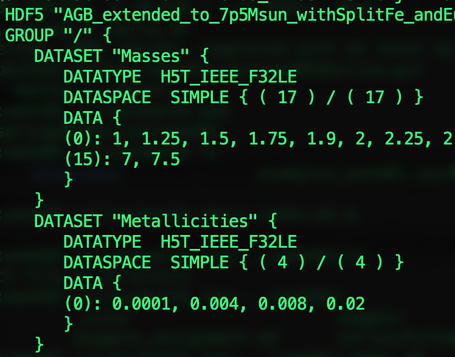
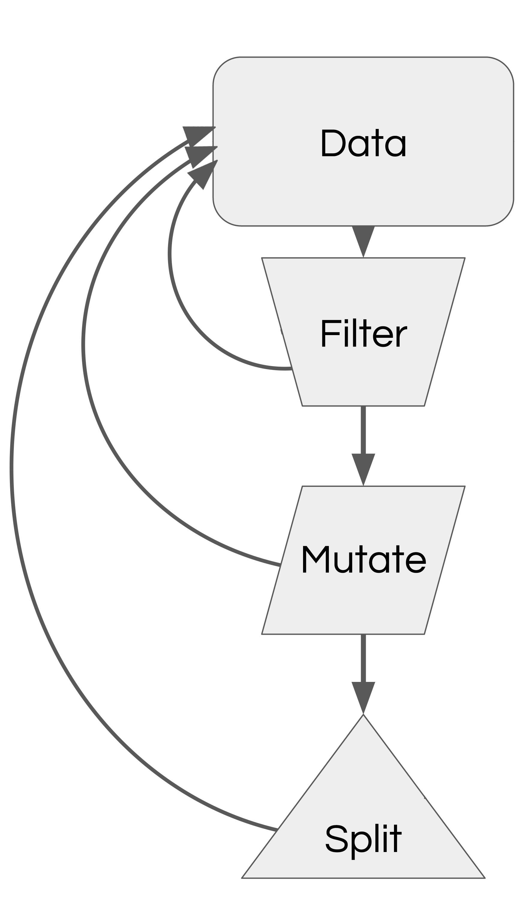

## Warm-Up Activity

1. What is the visualization trying to show?
1. What are its methods?
1. What are the strengths / weaknesses?

</br>
 * https://zzzev.com/movies

---

## This lecture

 * Data organization (quick)
 * Stuff

</br>
</br>

## If time permits

 * Grammar of Graphics
 * bqplot and dashboarding

---

# Data organization: A few notes

---

<!-- .slide: data-background-image="images/viz_diagram.svg.png" data-background-size="contain"-->

notes: Today we are going to discuss different sorts of data formats.

---

<!-- .slide: data-background-image="images/viz_diagram2.svg.png" data-background-size="contain"-->

notes: Usually we are going to be
able to make use of readers

---

<!-- .slide: class="two-floating-elements" -->

## Files, Data, and Organization

* Text
  * <span style="color:red">ASCII (raw)</span>
  * <span style="color:red">CSV / TSV</span>
  * JSON
* Binary
  * HDF5
  * PNG/BMP/GIF/JPG/etc
  * Excel
  * Arrow
* Query-based
  * SQL
  * JSON/REST

<div class="right" markdown=1>

<!---->


<!---->



</div>

notes:

we are predominatley using ASCII and CSV files in this class which is basically files with letters and numbers in rows and columns, but its worth mentioning that there *many* other ways data can be stored like in binary files to compress storage space or file formats that are ment for accessing a bunch like query-based file systems

read-write operations from disk are extremely time consuming, so raw text files come with massive overhead

REST = REpresentational State Transfer - web architecture that keeps clients and servers independent and queries using flexible JSON formatting.

---

## Doing Stuff with Data

Now that we understand a few ways that data can be stored, let's do some things
to it.

---

<div class="left">
<!-- .element: style="height: 20em;" -->
</div>

<div class="right" style="font-size: 150%;">
<div style="height: 4.0em;"></div>
You have a palette of operations to apply.
</div>

---

## Filtering Operations

 * Relationships:
   * Equality, inequality
   * Quantitative value (less than, greater than)
   * Intersection, disjoint
 * Subsampling
   * Regular sampling
   * Randomized sampling
   * Nyquist frequency
 * Related data queries
   * Queries on other columns at fixed row location
   * External membership queries

---

## Relationships Examples

 * Equality
   * Identity
   * Quantitative values
 * Ordering or quantitative
   * Less than (or equal)
   * Greater than (or equal)
   * "Comes before" and "Comes after"
 * Set-based operations
   * "Is a member"
   * "Is not a member"
   * "Shares members"
   * "Shares no members"

---

## Examples

### Equality

```
value == "hello"
value == 10
```

### Ordering and Quantitative

```
value < 30
value > July 1, 2010
```

### Set-Based

```
value in ("red", "blue")
value not in (3.141, 2.7)
```


