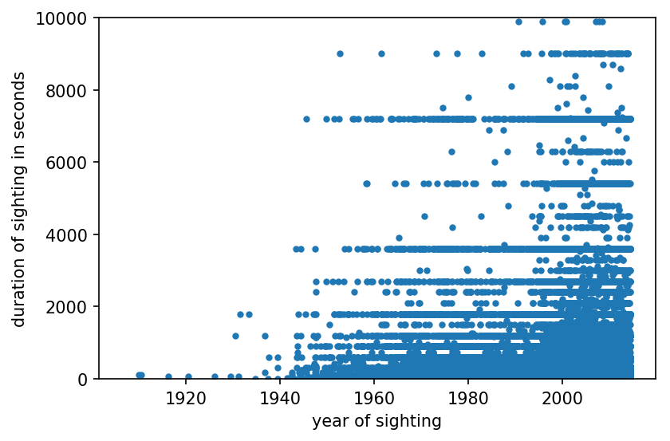
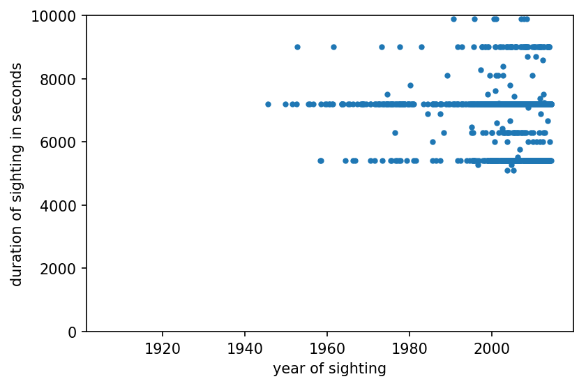
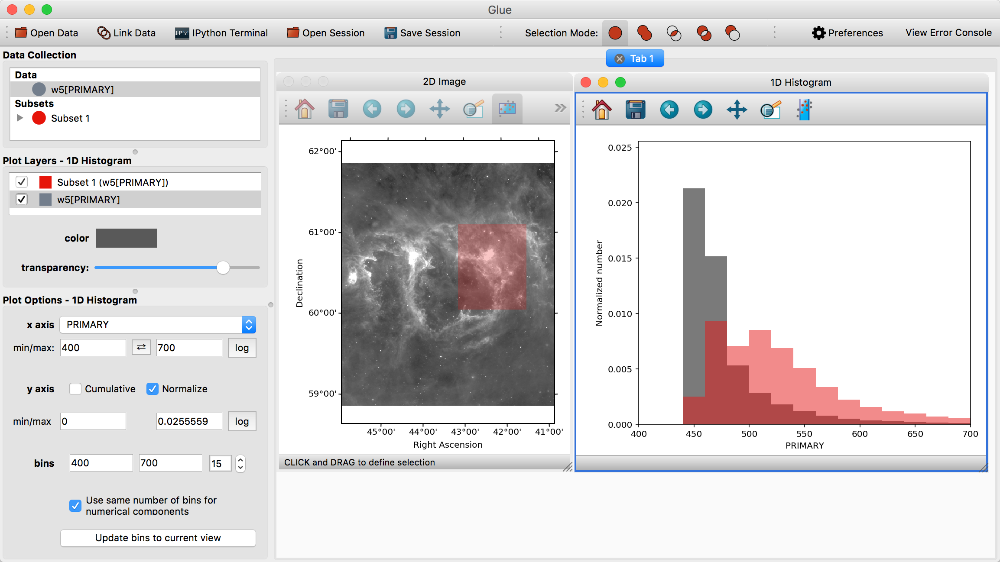

## This lecture

 * ~~Data organization (quick)~~
 * ~~Doing stuff with data~~
 * ~~Dimensions of representation~~


## If time permits

 * Grammar of Graphics
 * bqplot and dashboarding

notes: hurray! we have time for this!

---

<br />
<br />
<br />

# TOPIC 2: Linking & Brushing - Intro to bqplot

notes: bqplot can be used to make "dashboards" - i.e. linked data views - to help the user make sense of their data

before delving into that, we should specify what we mean by "linked views"

---

## Interactivity: Linking & Brushing

<!-- .slide: data-background-image="images/brushlink_02.svg" data-background-size="80% auto" data-background-position="right 50% bottom 50%" -->

`data(variable1, variable2, variable3, variable4)`

note: here we are plotting a set of data that is a function of 4 variables.

For example, this could be the amount you are late to class as a function of (1) how much sleep you got, (2) how excited you are about the topic that day (3) how nervous you are about the topic that day and (4) how much of your homework the dog ate.

here we are plotting 2 2d plots of this dataset - were we know intuatively each point is represented both as a dot on the first graph *and* as a dot on the 2nd graph

---

## Interactivity: Linking & Brushing

<!-- .slide: data-background-image="images/brushlink_02.svg" data-background-size="80% auto" data-background-position="right 50% bottom 50%" -->

`data(variable1, variable2, variable3, variable4)`

`filter( variable2 > variable1 )`

note: now we are going to think about applying a simple filter, based around the first plot

we'll only show data where variable2 > variable1

---

## Interactivity: Linking & Brushing

<!-- .slide: data-background-image="images/brushlink_03.svg" data-background-size="80% auto" data-background-position="right 50% bottom 50%" -->

`data(variable1, variable2, variable3, variable4)`

`filter( variable2 > variable1 )`

note: lets draw a line where the demarkation of our filter would be

---

## Interactivity: Linking & Brushing

<!-- .slide: data-background-image="images/brushlink_04.svg" data-background-size="80% auto" data-background-position="right 50% bottom 50%" -->

`data(variable1, variable2, variable3, variable4)`

`filter( variable2 > variable1 )`

note: ... and lets take out all the data of both plots that has variable2 <= variable1

---

## Interactivity: Linking & Brushing

<!-- .slide: data-background-image="images/brushlink_05.svg" data-background-size="80% auto" data-background-position="right 50% bottom 50%" -->

note: we can also select regions in our linked view

---

## Interactivity: Linking & Brushing

<!-- .slide: data-background-image="images/brushlink_06.svg" data-background-size="80% auto" data-background-position="right 50% bottom 50%" -->

note: here are how these points are linked in the plot of variable3 vs variable4

---

## Interactivity: Linking & Brushing

<!-- .slide: data-background-image="images/brushlink_07.svg" data-background-size="80% auto" data-background-position="right 50% bottom 50%" -->

note: so when we select with our brush in the first plot we can show what is selected in the second plot

---

## Interactivity: Linking & Brushing with UFO data



note: as a "practical" example, we can for example make cuts in things like the
duration of UFO sitings for all years

this is from a dataset that can be found on the grad-level viz course linked in lesson 06

---

## Interactivity: Linking & Brushing with UFO data


note: we can select only the longest sitings

---

## Interactivity: Linking & Brushing with UFO data



note: this is how this plot would now look

---

## Interactivity: Linking & Brushing with UFO data


note: and then we can see how the map changes

this is our original

---

## Interactivity: Linking & Brushing with UFO data


note: this is how this dataset looks now w/o the shortest duration ufo sitings

---

<iframe width="1024" height="576"
src="https://www.youtube.com/embed/B7XoW2qiFUA?rel=0" frameborder="0"
allow="autoplay; encrypted-media" allowfullscreen></iframe>
[Link to video](https://www.youtube.com/embed/B7XoW2qiFUA)

note: here is one of the first examples of a "linked view" visualization machine.  We won't watch this whole video, but
if you are interested, they talk about how they can "interact" with different views

this was developed by SLAC (stanford linear accelerator)

prim9 = picturing, rotation, isolation & masking in up to 9 dimensions - for looking at multidimensional datasets
this was developed for particle data (so, like x,y,z and vx,vy,vz might be of interest)

---

## Implementing This

Two main approaches to the selection process:

 * Concurrent filtering
 * Index-based selection

What are the pros and cons of each?

What are methods of showing "linked" and "brushed" data if you have:

 * Scatter plot
 * Histogram
 * Field / image plot

---

<br />
<br />
<br />

# TOPIC 2: Practical application with bqplot

---

## More bqplot

Today, we return to bqplot to explore interactivity.

Recall that with bqplot, we construct a set of objects that are related:

 * Scales
 * Axes
 * Marks
 * Figures
 * Interactions

---

## Scales

We have dealt primarily with quantitative scales.  bqplot provides several
scales we can utilize:

 * `LogScale`
 * `LinearScale`
 * `DateScale`
 * `OrdinalScale`
 * `ColorScale`
 * A few more as well.

([documentation](https://bqplot.readthedocs.io/en/latest/_generate/bqplot.scales.Scale.html))

---

## Marks

bqplot has several different ```marks``` we can explore.  We will utilize a few 
today:

 * ~~`HeatMap`~~
 * `GridHeatMap`
 * ~~`Bars`~~
 * ~~`Graph`~~
 * `Lines`

([documentation](https://bqplot.readthedocs.io/en/latest/_generate/bqplot.marks.Mark.html))

notes: we won't cover the ones that are crossed out explictly, but they are available on bqplot

---

## bqplot interaction

`bqplot` widgets are all based on `ipywidgets`.  This
means we use the same systems for describing the two.

We add an interaction to a given figure via the `interaction` keyword argument
to a figure.

---

## bqplot interactors

We will be able to use these different interaction methods:

 * `FastIntervalSelector`
 * `IndexSelector`
 * `BrushIntervalSelector` & `BrushSelector`
 * `MultiSelector` 
 * `LassoSelector`
 * `HandDraw`
 * `PanZoom`
 * `Tooltip`

notes: we will use just a "selection" tool in our heatmap to make a dashboard, but there are many fun things you can do with bqplot!

---

<br />
<br />
<br />

# TOPIC 3: Dashboarding

---

## Today's Python Programming:

Starting with these ideas, we'll progressively enhance.

 * Create heat maps of eccentricities and radia of Kepler data
 * Plot analytical orbits linked to the user's choices on this heatmap

We'll use these to build up a _dashboard_ for our data.

---

## Dashboards: Tableau


notes: so here is an example of a dashboard, I *think* from Tableau.  Here we see a linked view which
displays data in several different ways to give the user the ability to visualize what their data
means spatially (with the map & region bargraph) and temporally (with the calendar/bar view at the bottom)

---

## Dashboards: Glueviz


note: aside, there are opensource dashboarding type software, this is an example of glueviz that is
used a lot in astronomy and built on python

This is an example of binning light (dark or bright pixels) in an image of a star forming region (I think),
and linking this with a histogram which responds to a selection tool (in red) in the image.

---

## Dashboards: Building our own in Python

To Python!

---

